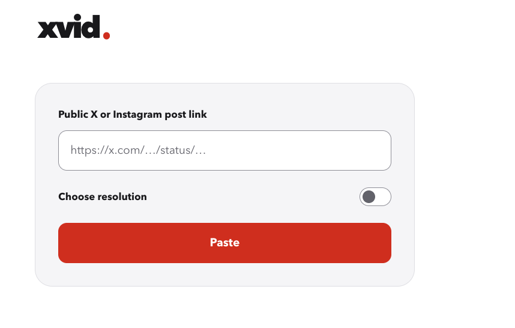
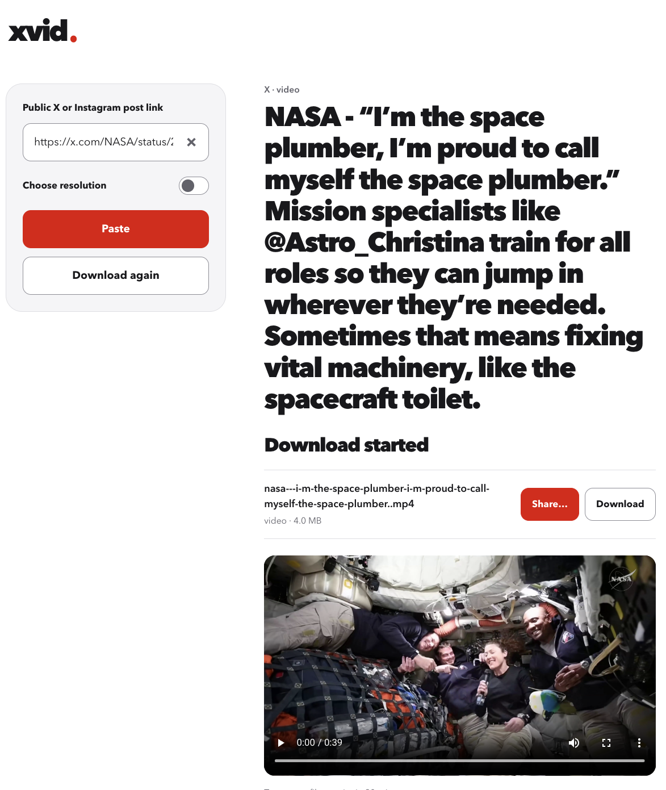

# xvid

**Paste a link. Keep the original.**

Xvid saves videos and photos from public X and Instagram posts. It picks the best
available quality for you, so most downloads start with a single paste.

**[Open Xvid](https://xvid.plosca.ru/)** · [Run it yourself](docs/DEVELOPMENT.md)

  

## A short path from link to file

Leave **Choose resolution** off to get the best available version. Turn it on
when you want a smaller file, then tap the resolution you want. Xvid keeps your
link in place, so you can try another size without starting over.

  

On iPhone, the save button opens the familiar sharing options. Posts with several
photos can be saved together; on desktop, **Download all** puts a post’s files
into one ZIP. For an Instagram carousel, you choose the photo or video you want.

## Keep the quality

Xvid doesn’t recompress the file you choose. For X downloads, the server finds
the available versions and your browser gets the media directly from X. The
video doesn’t need to make a detour through the server’s disk first.

Instagram uses the existing server download path. Temporary download pages
expire automatically; Xvid isn’t a permanent media library.

Availability and larger files

Xvid works with public posts. Private posts, login walls, and provider restrictions
can prevent a download; Instagram Stories and profiles aren’t supported.

Preparing a file for browser download or sharing is limited to 64 MiB. ZIPs share
that limit across their files. For larger videos, **Download** can stream to a
file in browsers with a file picker, up to 4 GiB. Other browsers open the original
so you can use their own save controls. The exact saving options depend on your
browser and device.

## Run your own copy

The web app is a Zig server with ordinary HTML, CSS, and JavaScript. It resolves
posts itself, which keeps the path from pasting a link to saving a file short.

To build or run it on Linux, start with the [development guide](docs/DEVELOPMENT.md).
For a hosted installation, see [operations and deployment](OPERATIONS.md).
The provider notes explain how the [X](docs/x/UPSTREAM.md) and
[Instagram](docs/instagram/UPSTREAM.md) integrations work.
